## 2024.12.19更新:
增加不死uboot更新方式

详见ImmortalWrt-Readme.md

## 2024.12.16更新:
新增一条steam下载规则命中漏网之鱼
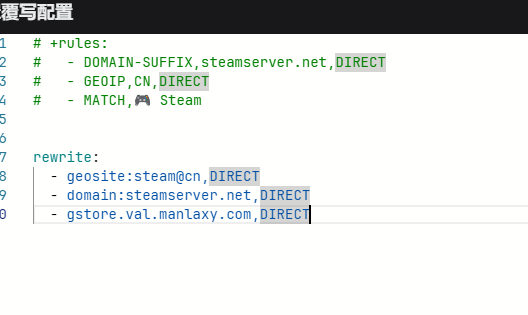

## 2024.12.12更新:
增加Steam规则,具体为除下载外都走代理,杜绝加速器,steam代理组选择代理
```
rules:
  - geosite:steam@cn, DIRECT
  - domain:steamserver.net, DIRECT
```
经测试发现效果正常,等待后续使用验证

下载游戏时连接内看不到下载的速度,应该是走了geosite:cn

另:写法可能有所区别,未找到等价写法

## 2024.11.23更新:
发现打开Gmail还是会弹出无网络连,真是闹麻了

等待验证

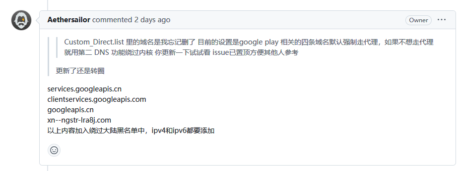


## 2024.11.22更新:
在[这里](#20241122)发现一个盲点，现已打开

## 2024.11.14更新:
在[这里](#20241114)增加了测试结果
，重启了一次路由器

## 2024.11.13晚:发现一个新的[低延迟dns](#20241113晚)

## 2024.11.13更新:
增加[dns测试](#20241113)更新

## 2024.11.12更新:
修改[dns](#20241112)获取方式

## 2024.11.8 更新:
增加[这里的](#openclash规则附加)截图

## 2024.11.7 19:09更新:
增加配置截图，增加[规则附加](#openclash规则附加)配置项

## 2024.11.7更新:
修改[复写-常规设置](#复写-常规设置)，增加github地址修改配置项

## 2024.11.5更新:
增加[DNS](#2024115)测试结果

## 2024.11.4更新:
[这里](#2024114)

---

## tips:
网络-DHCP/DNS-静态地址分配

配置主机名和MAC地址绑定

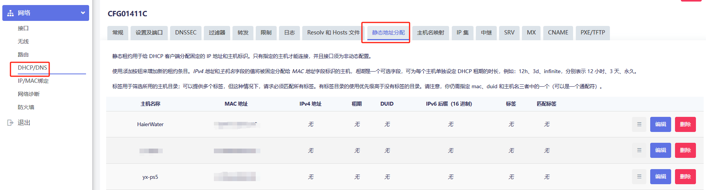

自定义在线分流规则模板教程
- https://www.youtube.com/watch?v=D841V_xgykg&list=PLSbqX2QvapHk7VYlbyHUIOonIl7q1n410&index=3

七尺宇openclash所需资料
- https://qichiyu.blogspot.com/2024/07/openclash.html

openclash配置自定义策略集教程
- https://github.com/Aethersailor/Custom_OpenClash_Rules/wiki/OpenClash-%E8%AE%BE%E7%BD%AE%E6%95%99%E7%A8%8B

## 软件包替换源:
将源地址
- https://downloads.immortalwrt.org

或
- https://mirrors.vsean.net/openwrt

修改为:
        
    https://mirrors.cernet.edu.cn/immortalwrt

## 常用软件包名:
luci-theme-argon			argon主题

luci-app-adguardhome		自行github下载，链接:https://github.com/kongfl888/luci-app-adguardhome/releases

建议下载20221023，自带中文。最新版安装英文后再安装中文好像有冲突

*~~luci-app-arpbind			IP/MAC地址绑定~~*
自带,不用搞这个

luci-app-openclash			不解释

---

# immortalwrt关闭ipv6:
## lan口
网络-接口:删除wan6接口，编辑br-lan接口

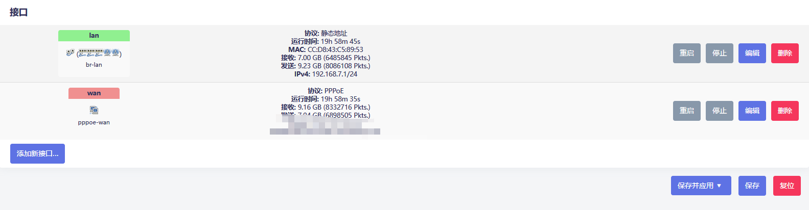

DHCP服务器-ipv6设置:禁用三个ipv6服务，不勾选指定的主接口

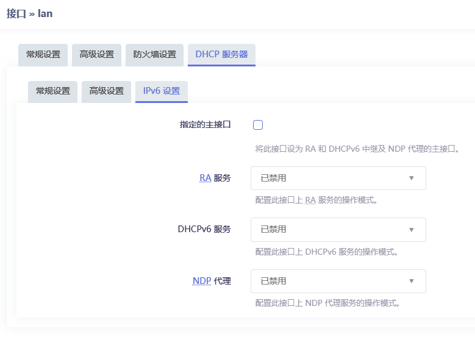

全局网络选项删除ipv6地址


## 网络-DHCP/DNS-过滤器
勾选过滤ipv6 AAAA记录

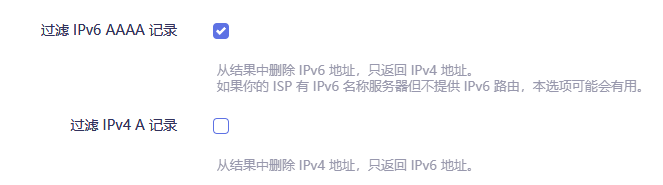

以上之后，局域网设备就不会被分配ipv6地址了

## wan口
br-lan的网段不可以和wan的网段相同

接口配置wan口禁用获取ipv6地址

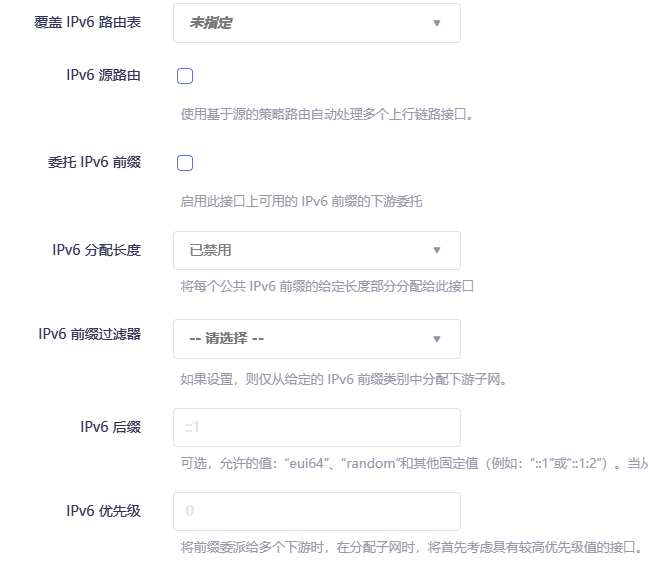

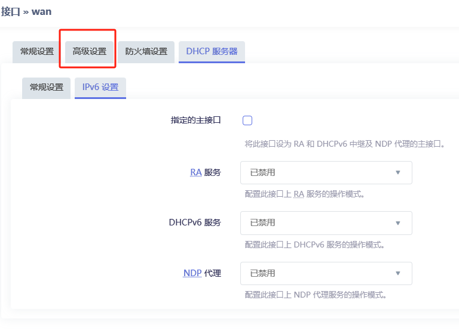

---

# openclash插件设置:

## 插件-模式设置
勾选使用meta内核，需要提前下载并上传meta内核文件

运行模式:Fake-IP(混合)模式

网络栈类型:mixed(2024.11.7版本openclash仅剩meta内核)

勾选UDP流量转发

代理模式Rule

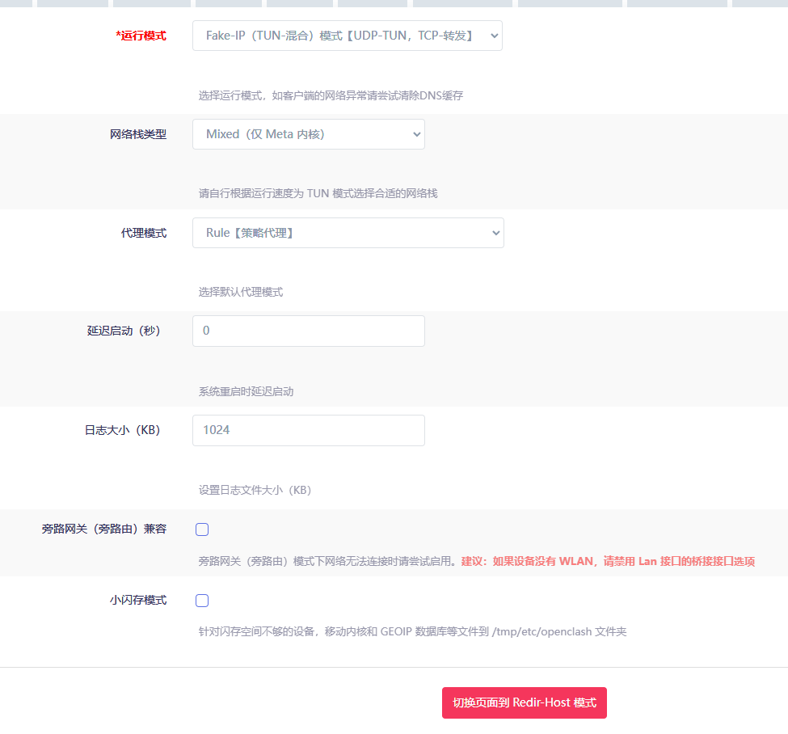

## 插件-流量控制
勾选路由本机代理、禁用QUIC、绕过服务器地址、实验性绕过中国大陆IP（配置延迟低的dns）、仅允许内网

仅允许内网下方选择wan接口名字为wan（个人配置不同）

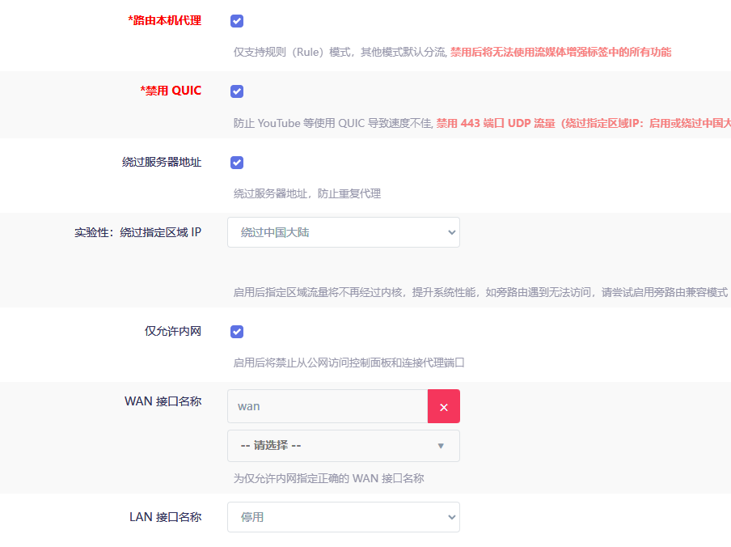

## 插件-DNS设置
先选择使用Dnsmasq进行转发，彻底配置好之后选择停用

清理一下持久化缓存，勾选禁止Dnsmasq缓存DNS

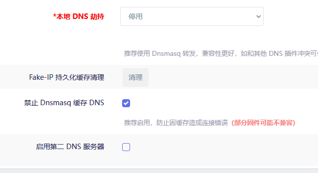

## 插件-流媒体增强
忽略

## 插件-黑白名单（复写设置-规则设置）:
不走代理的wanip，设置该项为188，复写设置内编辑规则为

- SRC-IP-CIDR,192.168.7.233/32,DIRECT	

（意为7.233ip设备走直连

- SRC-IP-CIDR,192.168.7.233/32,节点分组名	

（意为7.233ip设备走指定节点分组。例如:- SRC-IP-CIDR,192.168.7.233/32,🚀 手动切换
经测试发现黑白名单和自定义规则都可以实现不走代理

区别在于黑白名单只能定义ip

自定义规则可以定义域名:

- DOMAIN-SUFFIX,google.com,（代理组名） #匹配域名后缀，意为xxx.google.com走代理
- DOMAIN-KEYWORD,google,DIRECT（代理组名） #匹配域名关键字，意为域名含有google的走DIRECT
- DOMAIN,google.com,DIRECT（代理组名） #匹配域名，意为全域名匹配成功的走DIRECT

## 插件-IPV6设置
取消勾选，不使用IPV6

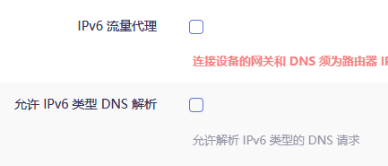

## 插件-GEO数据库订阅
可以使用默认链接

<font size=3 color=#FA8072>geoipDat老版本数据库，文件太大，不采用</font>

geoip mmdb更新url:
- https://raw.githubusercontent.com/Loyalsoldier/geoip/release/Country.mmdb
- https://cdn.jsdelivr.net/gh/Loyalsoldier/geoip@release/Country.mmdb

geosite更新url:
- https://github.com/Loyalsoldier/v2ray-rules-dat/releases/latest/download/geosite.dat
- https://cdn.jsdelivr.net/gh/Loyalsoldier/v2ray-rules-dat@release/geosite.dat

每天或每周更新一次，设置完自定义URL后点击检查并更新进行更新，单纯点击保存配置没有用

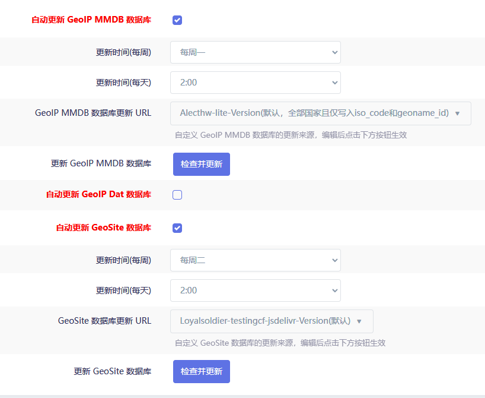

## 插件-大陆白名单订阅:
勾选自动更新，其余默认即可

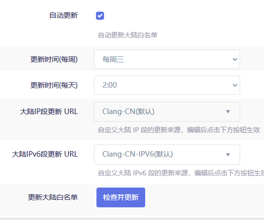

---

# openclash复写设置:
## 复写-常规设置:
<font size=3 color=#EEA2AD>如果更新订阅出现【tmp/yaml_sub_tmp_config.yaml】下载失败等无法连接github错误

可以在Github地址修改中自定义github的国内mirror前缀，链接参考《一个链接实现模板和订阅转换》</font>

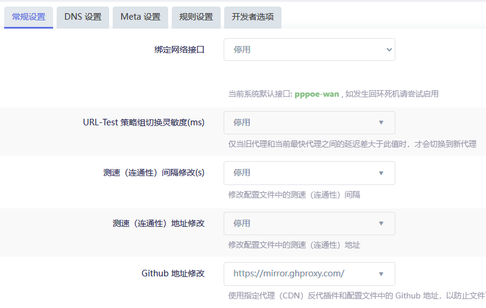

## 复写-DNS设置:
勾选Fake-ip持久化，Fake-IP-Filter

~~<font size=3 color=#EEA2AD>**_若为桥接模式，暂定不需要勾选自定义dns服务器，可能会导致软件刚打开解析dns时间过长_**~~

~~**_由此推断若为路由模式，则只需要自定义dns服务器为光猫dns，不需要追加上游dns_**</font>~~

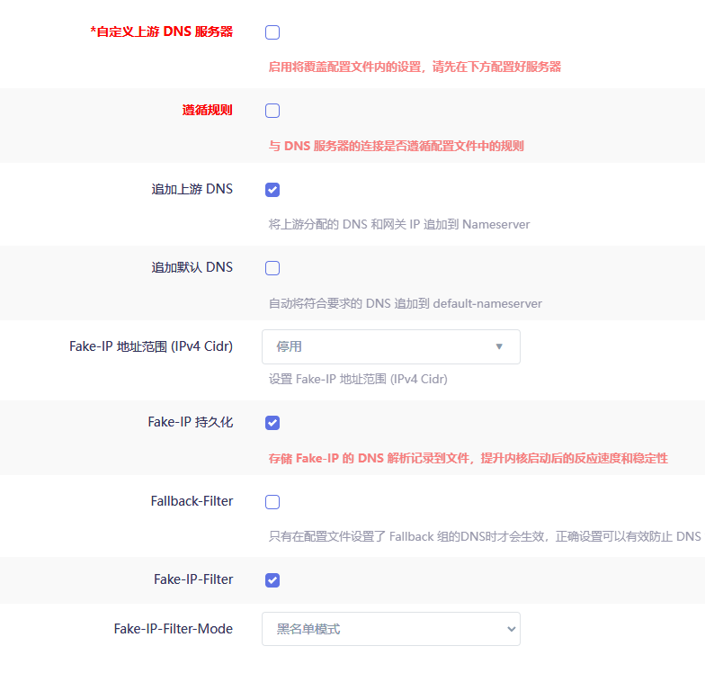

---

### DNS调试日志

#### 2024.11.4:

取消勾选自定义服务器，保留追加上游dns不需要等待

#### 2024.11.5:

测试后发现关闭自定义DNS服务器、只保留追加上游DNS不需要加载等待（PPPOE拨号模式下），猜测如果为路由模式需要自定义DNS服务器，取消勾选追加上游DNS

#### 2024.11.12:

根据如下教程修改dns:

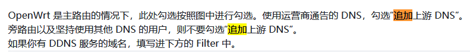

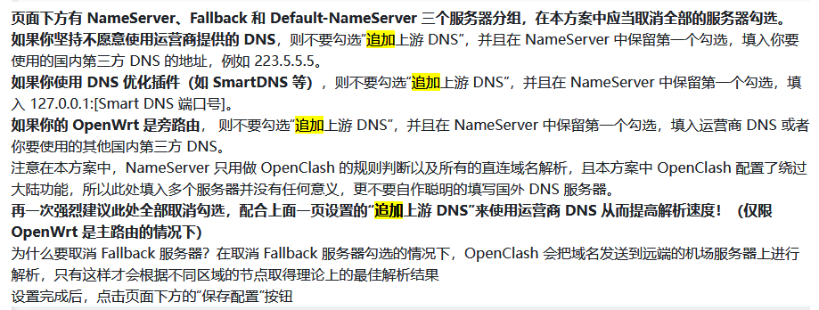

<font size=3>使用[DNS优选软件](https://github.com/yixuan-ovo/TutorialFiles/blob/main/Software-exe/DNS%E4%BC%98%E9%80%89.exe)
测试得知延迟最低的并非为运营商dns，所以修改为下图配置:</font>

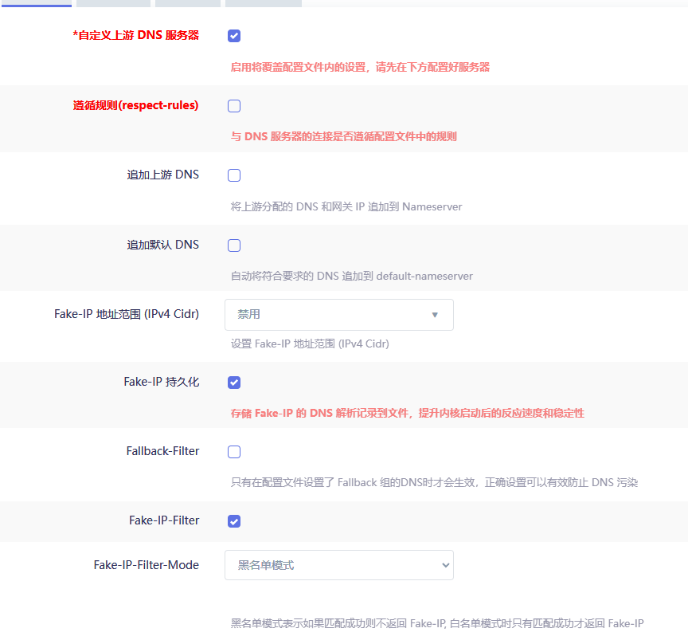

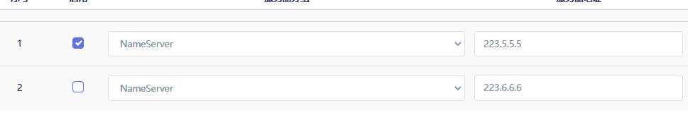

#### 2024.11.13:

又改回去了......
现在依旧是关闭自定义DNS服务器，保留追加上游DNS，否则还是会出现刚打开例如Gmail等应用初始无网络连接
需要等待一分多钟才可以正常访问的情况
#### *缺点是可能造成dns污染*

等待解决

~~根据穷举法，现在该尝试勾选自定义上游服务器+nameserver填写223.5.5.5，同时勾选追加上游dns的效果~~

#### 2024.11.13晚:

使用DnsTools软件测量得到比223.5.5.5延迟更低的dns

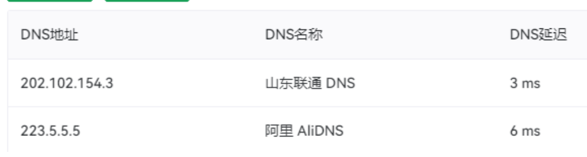

所以将wan口pppoe自动获取dns取消，改为手动

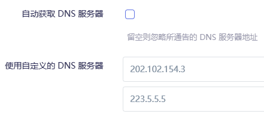

同时测试了勾选自定义dns上游服务器和追加上游dns，效果依旧会初始无连接，此方案暂时抛弃

尝试不勾选自定义上游dns服务器和追加上游dns，使用默认dns设置，查看配置文件发现配置的dns不如202

测试在保持勾选追加上游dns时，勾与不勾选自定义上游，**发现在配置文件内nameserver无变化**，没有答案等待学习...

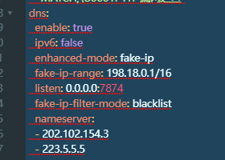

发现一个问题:通过修改[这里](#openclash规则附加)无法实现域名的单独配置，等待寻找答案

---

#### 2024.11.14:

穷举法懒得试了，感觉没用，再多也只是根据第一个dns进行解析，今日将方案暂定为不勾选自定义上游dns服务器，只勾选追加上游dns

等待解决规则集文件无法实现域名直连的问题，可能规则集文件内已有直连规则集，但yacd面板的规则内只有这一个自定义规则集，考虑在内置规则集内增加直连域名/修改自己规则集文件的创建设置，以便于实现不重启就可以增加域名直连的功能。~~提交PR也可以，就是太麻烦了，还不一定采用~~

~~不然流量遭不住~~

同时学习搭建自己的docker解析服务器及ymal文件编写

重启了一次路由器，然后开启Gmai，不会无网络连接并等待

发现一个新的提示，意义不明:

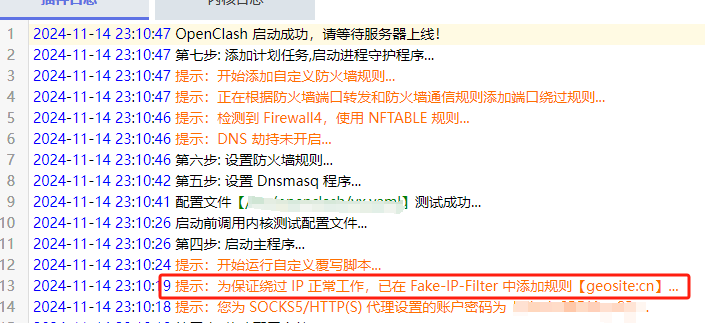

#### 2024.11.15

发现路由器灯光变为蓝绿正常灯光，可能该设置为正常设置

---

## 复写-Meta设置:
勾选启用TCP并发、启用统一延迟（为了测速好看，可开可不开）、Fake-IP持久化、启用流量(域名)探测、探测(嗅探)纯IP连接

其余停用或不勾选

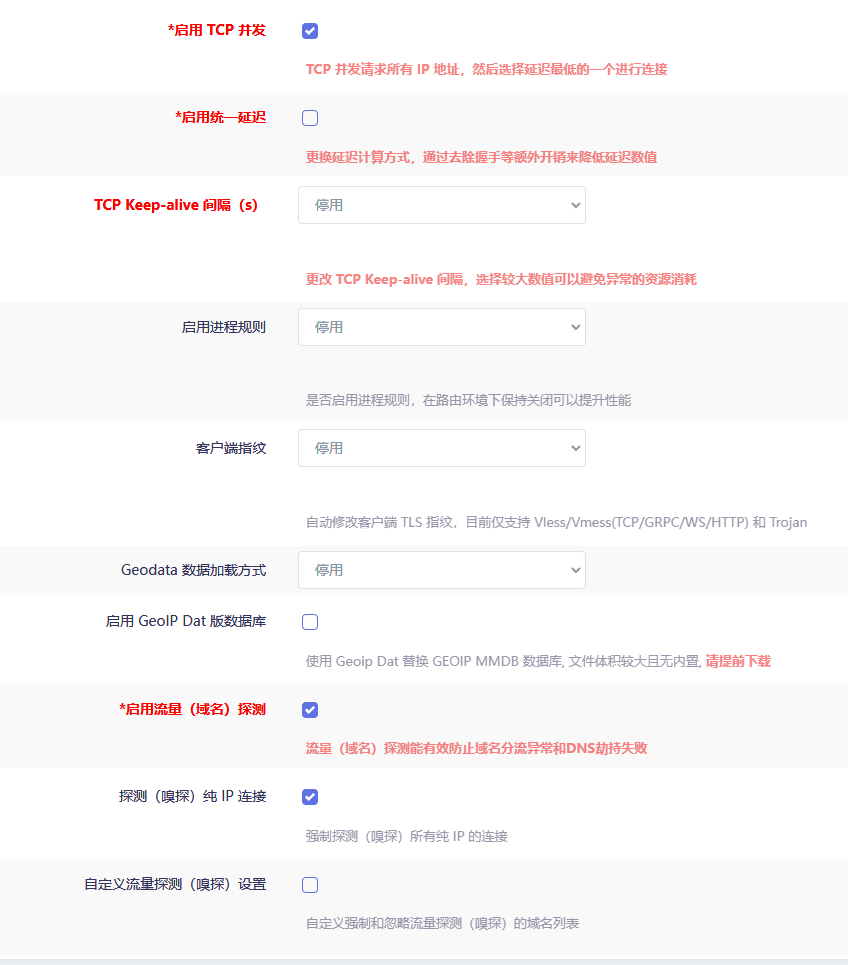

## 复写-规则设置:
参考上方黑白名单


## 复写-开发者选项:
找到下方一行，将最后的true改成false，取消注释，嗅探TLS作用为:**？**

ruby_edit "$CONFIG_FILE" "['experimental']" "{'sniff-tls-sni'=>false}"

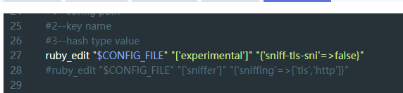

# openclash规则附加:
<font size=3 color=#EEA2AD>**_如图配置后，可以在无需重启openclash服务的情况下增加直连域名/ip_**</font>

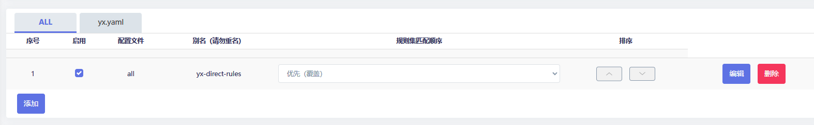

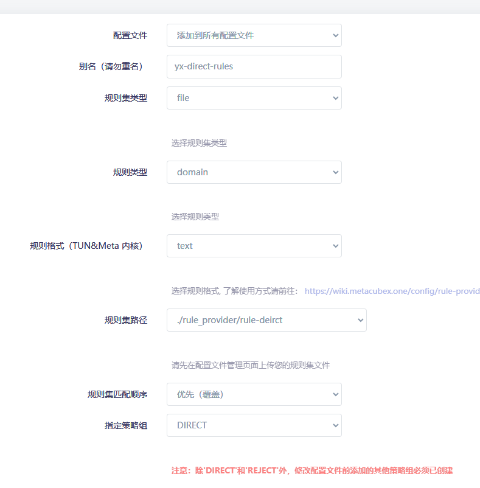

<font size=3>此时在管理规则集文件列表里面找到自己新建的规则，点击进去直接加入想要走直连的域名即可</font>

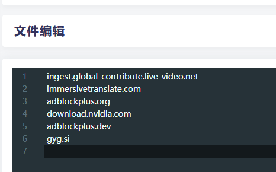

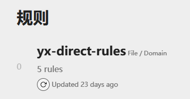

# openclash配置订阅
【漏网之鱼不能选全球直连！选择直连会泄露DNS。此时在绕过大陆ip选项的作用下，国内ip不会走clash内核】

测试dns泄露网址:https://ipleak.net/


# 勾选自动更新，修改配置文件:
勾选在线订阅转换，订阅转换服务地址clash-meta，订阅转换模板为自定义模板
-     https://mirror.ghproxy.com/https://raw.githubusercontent.com/yixuan-ovo/ImmortalWrt-Files/refs/heads/main/OpenClash/subscribe-ini/yx-clash.ini
      参考《一个链接同时实现配置模板和后端订阅转换》

添加Emoji可开，UDP转发需要机场支持才可启用，否则无法过梯

### 2024.11.22:
*<font size=3>需要打开启用规则集文件，可以提高代理的速度！</font>*

---

# [下一步配置AdGuardHome在这里](https://github.com/yixuan-ovo/AdGuardHome_yx/blob/main/%E9%85%8D%E7%BD%AEAdGuardHome.md)

---

# :
## redir_host存在的问题
连接不是私密链接的原因:ip被污染，节点服务器无法根据被污染的ip访问指定网站。

例如:假设google-ip为4.4.4.4，节点服务器向上请求谷歌首页ip获得5.5.5.5，此时拿5的ip去访问google则会出现网站证书和域名不匹配，显示为链接非私密。

## fake-ip
浏览器发起dns请求，请求获取谷歌的ip，请求向上走到路由器，

此时clash劫持该请求，此时模式为fake-ip模式，所以路由器从自身ip段选择一个fake-ip返回给浏览器，

并且于映射表记录fake-ip和域名的映射关系，

浏览器拿到这个fakeip之后，向这个fakeip发起谷歌的dns请求。

请求来到路由器之后clash根据该fakeip在对应表中查询对应的域名，使用域名进行规则匹配，根据google.com这个域名匹配到的规则决定走代理还是走直连。

此时根据规则把谷歌的域名交给远程节点服务器进行dns解析获取真实的谷歌ip（相当于将原来需要在本地做的dns解析放在了远程服务器，不存在dns泄露，少了一次dns请求，降低了延迟）

## 缺点为

某一次获取到了百度的fakeip，此时clash闪退，但电脑上缓存了百度的假ip。再次访问百度时会访问fakeip，此时将会无法访问。

虽然clash将ttl缓存设置为1s，但是程序不一定会遵守ttl的规定，为了防止频繁发起dns请求，可能会延长缓存时间。

还有一些程序会开启dns重绑保护，如果获取到私有ip则会认为非法dns劫持导致数据包丢弃，典型例子为:windows使用fakeip时电脑有网，但是联网图标显示没网。

解决办法是加入fake-ip-filter，放在里面的域名列表不会返回假的ip，会发起dns请求获取真实的ip地址，相当于这些域名的处理回退到redir-host模式。

另外由于udp在某些场景下必须使用真实ip，所以clash处理udp域名，即使使用fakeip模式也会发起dns请求，例如QUIC功能，解决办法是禁用浏览器的quic功能。